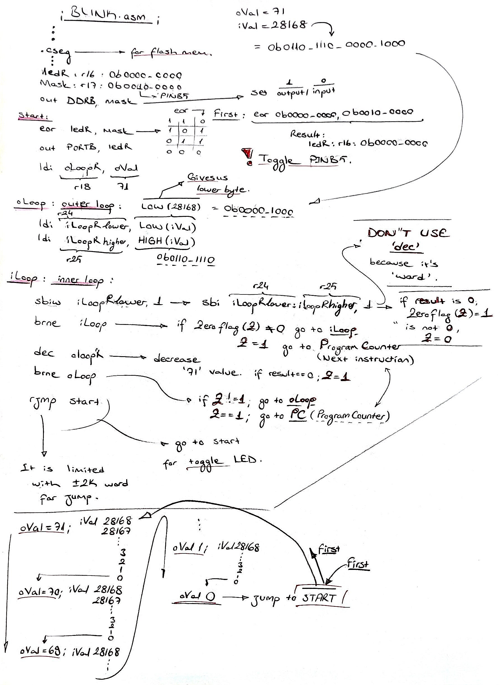

<h1>An Example: Blink</h1>
___

## Code

```asm
  .include "m328Pdef.inc"

  .def    mask    = r16
  .def    ledR    = r17
  .def    oLoopR  = r18
  .def    iLoopRl = r24
  .def    iLoopRh = r25

  .equ    oVal    = 71
  .equ    iVal    = 28168

  .cseg
  .org    0x00

  ; set PINB5 to output
  clr   ledR
  ldi   mask, (1<<PINB5)
  out   DDRB, mask

start:
  eor   ledR, mask ; toggle PINB0 in ledRegister
  out   PORTB, ledR ; write LedRegister to PortB

  ldi   oLoopR, oVal ; initialize outer Loop count

oLoop:
  ldi   iLoopRl, LOW(iVal)
  ldi   iLoopRh, HIGH(iVal) ; initialize inner Loop count
  ; LOW and HIGH give us lower and upper part of the value
  ; Done by assembler, not hardware

iLoop:
  sbiw    iLoopRl, 1
  brne    iLoop

  dec   oLoopR
  brne  oLoop

  rjmp    start
```

## Code Analyze

### ::`.def`

We can use `.def` directive to give registers names that we can remember easly. 

```asm
.def    mask = r16
; alias for r16 with 'mask'
```

### ::`.equ`

Like `.def` directive we can use `.equ` for give names to constant values.

```asm
.equ    oVal = 71
; alias for 71 with oVal
```

### Detailed Analyze



---

<script src="https://giscus.app/client.js"
        data-repo="safabey/avr-notes"
        data-repo-id="R_kgDOP0lO_A"
        data-category="Comments"
        data-category-id="DIC_kwDOP0lO_M4CvwBX"
        data-mapping="pathname"
        data-strict="0"
        data-reactions-enabled="1"
        data-emit-metadata="0"
        data-input-position="bottom"
        data-theme="preferred_color_scheme"
        data-lang="en"
        crossorigin="anonymous"
        async>
</script>